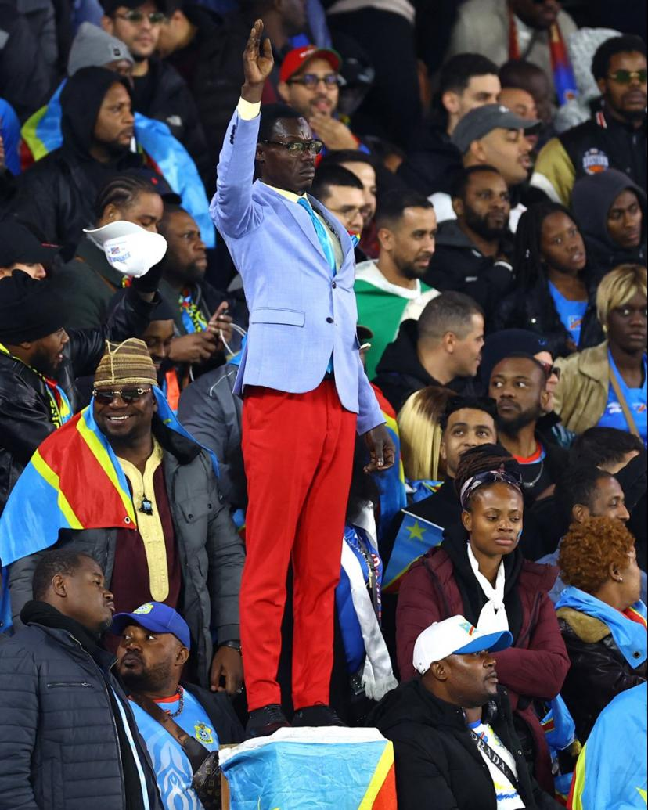

# The world cup as an outsider
I have exclusively been a fan of basketball my whole life, I regularly keep up with the National Basketball Association (NBA), have been gifted merch of my favourite player, James Harden, and have become friends with people just based on our common interest in basketball. I have also regularly made fun of football for being a boring sport, mostly as a joke, but as with many jokes, there tends to be some truth in them. 

## Why I am a hater
My biggest critique of football has always come down to nothing happening for most of the game. With most games ending with scores like 1-0, 2-0, 2-1 or the worst case, 0-0. I am also not a fan of the [flopping](#Flopping) that happens in games (you can click on the word to go to the definition for it) and finally I personally find the [offside](#Offside) rule to be incredibly detrimental to the watching experience of football, with the constant interruptions to play and revoking of goals ruining the momentum and thrill of the games. Having said that like many others I take a special interest in football whenever the world cup comes around as it is impossible to avoid whether in real life or social media

## World cup fever
The world cup is the biggest sporting event in the world and an argument could be made for it being the biggest event in the world in general. As such it is often not just a sporting event but a cultural event, with people from all around the world gathering in one location, proudly displaying their cultures and stories. A true representation of the term melting pot. In relation to the concepts taught in this course however, the teams in the world cup and their fans are examples of fandoms and global imaginaries that were covered in this course. Therefore I'll be going over what it has been like to be a part of a fandom as someone who has no stake in this world cup, since my home country of Singapore is not participating

## Online and offline fandom
Before we get into that however I want to take some time to go over what fandom can look like for those watching the world cup. Before social media had allowed for the unregulated sharing of information, the world cup was primarily consumed via tv broadcasts and communal screenings of the matches. In Singapore these communal screenings are carried out by the government at community centers all around the island. In many other countries these screenings are carried out my members of the public who share a passion for football

It is here that we see the first instance of the melding of the online and offline. People all around the world are able to watch matches live, surrounded by people. The act of watching the world cup game goes from a form of entertainment to a communal event fostering bonds among individuals.

The advent of the internet and social media has widely changed how we consume media. For example in basketball, social media has resulted in many fans of basketball choosing to view highlights of games rather than watch full games, a practice that I myself am guilty of. However, with respect to the world cup, the advent of social media has not changed how people view the world cup. Even now on social media we see millions of people all around the world gathering at communal spaces to watch matches. Fans in Singapore are often seen waking up at 5am in the morning just to watch these games. So the question is then what change has social media brought into how people consume the world cup. This leads me directly into why I have been more invested in this world cup as compared to previous world cups.

## The world cup as a medium for social change
While I was scrolling through my instagram feed, I came across a post about a super fan from the Democratic Republic of Congo (DR Congo) Michel Kuka Mboladinga also known as [Lumumba Vea](https://www.bbc.com/sport/football/articles/cy04vnlzkn2o). He was known for standing completely still in a pose, mimicking the statue of Patrice Lumumba (the first prime minister of DR Congo)

The post most interestingly was almost entirely focused on the man Lumumba Vea was emulating, Patrice Lumumba. It went over his impact and importance to the independence of Congo from Belgium and his unfortunate assassination at only 36. This singular post piqued my interest in the world cup well before the finals, which was the only game of the world cup that I had any care for in the past. I learned of the camaraderie shared between fans of Mexico and South Korea, due to their [historic ties](https://www.npr.org/2026/06/17/nx-s1-5835229/mexico-south-korea-world-cup-fans-coreano-hermano) both in and out of football. 

## Definitions
### Flopping
When you fake a foul that is clearly over exaggerated in order to gain an advantage. - Urban Dictionary
### Offside
A player is offside if they are nearer to the opponents goal line than both the ball and the second-last defender when a teammate plays the ball to them. They are penalized only if they are actively involved in play at that moment. Doesn't apply in one's own half or from goal kicks, corners, or throw-ins.
